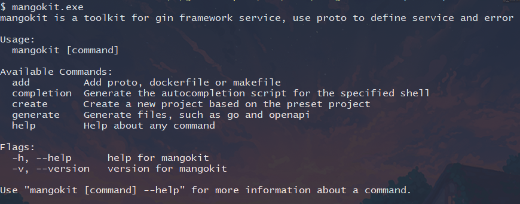

# Mangokit

Mangokit is a Go tool that helps you generate web projects based on a predefined project structure. It utilizes the Gin framework, Proto files for defining HTTP handlers and errors, and Wire for dependency injection.



## Features

- Generate a web project with a predefined project structure.
- Utilize the Gin framework for building robust and performant web applications.
- Define HTTP handlers and errors using Proto files for easy API contract management.
- Implement dependency injection using Wire for cleaner and more modular code.

## Install
```shell
git clone github.com/mangohow/mangokit
cd mangokit && make install

```
other tools:
```shell
# install proto-gen-go
go install google.golang.org/protobuf/cmd/protoc-gen-go@latest

# install wire
go install github.com/google/wire/cmd/wire@latest

# make sure you have protoc
```
    

## Getting Started

To get started with Mangokit, follow these steps:

1. Create a new web project: `mangokit create {projectFileName} {goModName}`.
2. `cd {projectFileName} && go mod tidy`
3. Generate go files from proto files: `mangokit generate proto {protoDir}`
4. Generate openapi from proto files: `mangokit generate openapi {protoDir}`.
5. Generate wire: `mangokit generate wire`.
6. Add a proto api: `mangokit add api {path} {protoName}`.
7. Add a proto error: `mangokit add error {path} {protoName}`.

## Example

    mangokit create helloworld github.com/xxx/helloworld
    cd helloworld && go mod tidy
    go run cmd/server/main.go cmd/server/wire_gen.go

## Usage

Mangokit provides the following commands:

- `mangokit create`: Generate a new web project based on the predefined structure.
- `mangokit generate`: Generate go files or openapi from proto files and wire.
- `mangokit add`: Add proto files, makefile and Dockerfile.


